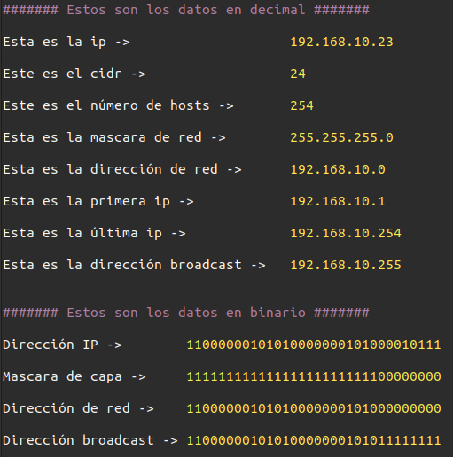

# IP Calculator

Este script programado en bash permite sacar toda la información de una ip como el número de hosts, última ip y otra información importante.

Uso
----
```bash
./ipCalculator.sh {ip}/{máscara}

#Ejemplo

./ipCalculator.sh 192.168.20.12/24
```
Captura
----

